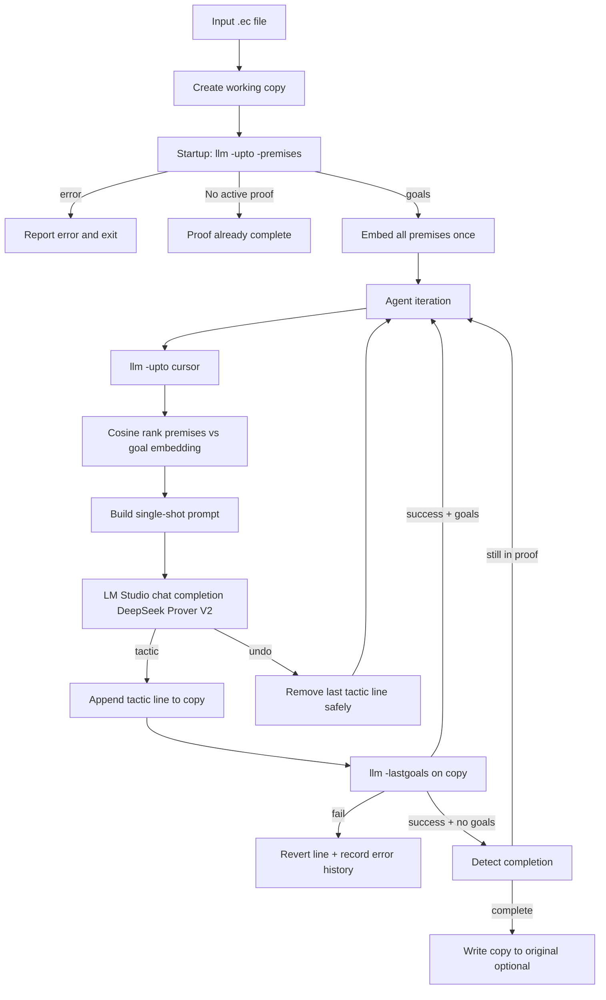

# EasyCrypt LLM Agent Loop Design

## Context

The patched EasyCrypt binary already exposes what the loop needs:


| Need                  | CLI                                | Notes                                                                                                            |
| --------------------- | ---------------------------------- | ---------------------------------------------------------------------------------------------------------------- |
| Proof state at cursor | `easycrypt llm -upto LINE FILE.ec` | Goals on stdout; `"No active proof."` when nothing is open                                                       |
| Premises at cursor    | `… -upto LINE -premises FILE.ec`   | Split on `(* --- premises --- *)\n` (`[integration/tests/test_premises.py](integration/tests/test_premises.py)`) |
| Tactic validation     | `easycrypt llm -lastgoals FILE.ec` | Exit 0 = file OK; exit 1 = stdout has pre-failure goals, stderr has error                                        |
| Startup error         | `llm -upto` non-zero exit          | Compilation fails before cursor → abort loop                                                                     |


Sample premise output (from the built binary) groups entries by theory (`========== Core ==========`) with one `lemma`/`axiom` per line—hundreds to thousands of entries on real files.

**User choices:** file-subprocess backend (no MCP); work on a **copy** of the input file and only promote to the original when the proof completes.

---

## Architecture




### Package layout (new)

```
integration/agent/
├── __init__.py
├── __main__.py              # CLI entry: python -m integration.agent proof.ec
├── config.py                # LM Studio URLs, model IDs, k, timeouts
├── easycrypt.py             # subprocess wrappers (goals, premises, validate)
├── premises.py              # parse premises block → dict[name, text]
├── embeddings.py            # LM Studio /v1/embeddings + cosine rank
├── prompt.py                # prompt template + few-shot tactics
├── llm.py                   # LM Studio /v1/chat/completions, parse tool response
├── proof_file.py            # cursor line, proof bounds, append/undo lines
├── error_history.py         # state-keyed failed-tactic store
├── loop.py                  # main agent loop
└── examples/
    └── tactics_fewshot.md   # curated examples from EASYCRYPT_PROOF_REFERENCE.md
```

Reuse `[integration/tests/conftest.py](integration/tests/conftest.py)` binary resolution (`EASYCRYPT` env or `integration/extern/easycrypt/_build/default/src/ec.exe`).

---

## Cursor and file semantics

**Problem:** `-upto LINE` stops *before* the command starting at `LINE` (`[EC_api_report.md](EC_api_report.md)`). “Last line is where the proof left off” must be mapped precisely.

**Convention:**

1. `last_line` = index of last non-empty line in the file (1-based).
2. `cursor_upto = last_line + 1` — proof state *after* everything through `last_line` has been processed.
3. If `cursor_upto` is past EOF, use `last_line + 1` anyway (EasyCrypt treats this as “compile all commands, then stop”).

**Proof body bounds** (for safe undo):

- Scan upward from `last_line` to find the enclosing `proof.` line → `proof_start_line`.
- Never delete at or before `proof_start_line` (preserves lemma signature + `proof.`).
- If a `qed.` exists after `proof_start_line`, tactics live strictly between them; append new tactics immediately before `qed.` (or after `proof.` if no `qed.` yet).

**Working copy:** `proof.ec` → `proof.ec.agent` (suffix configurable). All mutations go to the copy. On successful completion, optionally copy back to the original path (`--promote` flag).

---

## Startup phase

```python
result = run_llm(["llm", "-upto", str(cursor_upto), "-premises", copy_path])
if result.returncode != 0:
    return StartupError(stderr=result.stderr)

goal_text, premises_text = split_stdout(result.stdout)  # SEPARATOR from test_premises.py
if goal_text.strip() == "No active proof.":
    return Complete(already_done=True)

premises = parse_premises(premises_text)  # dict[str, str]
embeddings = embed_batch(premises.values())  # one LM Studio call per batch
premise_index = {name: vec for name, vec in zip(premises, embeddings)}
```

### Premise parsing (`[premises.py](integration/agent/premises.py)`)

Regex-driven parser on the premises block:

- Skip theory headers (`========== … ==========`).
- Each premise line: `^(lemma|axiom)\s+(\w+)[^:]*:\s*(.+)$`
- Key = `name`; value = full line + optional theory context prefix for richer embeddings.

**Scale:** `AllCore` alone yields thousands of entries. Mitigations:

- **Disk cache:** `.{file}.premises_cache.json` keyed by `(copy mtime, cursor_upto, embedding_model_id)`.
- **Batch embeddings:** `input=[...]` in chunks of 64–128.
- **Optional cap:** `--max-premises N` for debugging only (default: no cap).

**Refresh:** Re-fetch and re-embed only if the copy gains new top-level `lemma`/`axiom` declarations above the cursor (detect via outline scan); otherwise reuse cache.

---

## Agent iteration (stateless “new chat”)

Each iteration is **one** `POST /v1/chat/completions` with a single `user` message—no prior chat history. All context lives in the prompt. This is the efficient equivalent of “start a new chat every iteration.”

### Step 1 — Observe

```python
goal = fetch_goal(copy_path, cursor_upto)  # llm -upto only
if goal == "No active proof.":
    return Complete()
```

### Step 2 — Rank premises

```python
goal_vec = embed(goal)
top_k = rank_by_cosine(premise_index, goal_vec, k=config.top_k)  # default k=10
```

Cosine similarity: `numpy` dot product on L2-normalized vectors (lightweight dep).

### Step 3 — Build prompt

Sections (fixed order, deterministic):

1. **System role** — EasyCrypt tactic agent; must output exactly one tool call.
2. **Few-shot examples** — 5–10 curated pairs from `[EASYCRYPT_PROOF_REFERENCE.md](EASYCRYPT_PROOF_REFERENCE.md)` (e.g. `by ring.`, `rewrite addr0.`, `smt()`, `proc; auto.`).
3. **Current goal** — raw `goal` text from EasyCrypt.
4. **Top-k premises** — name + statement for each ranked entry.
5. **Failed tactics at this state** — from error history (below).
6. **Tail of proof script** — last ~20 lines of the copy around the cursor (local context).
7. **Tool spec** — JSON schema the model must emit.

**Tool schema (structured output):**

```json
{"action": "tactic", "tactic": "by rewrite addr0."}
```

or

```json
{"action": "undo"}
```

Prefer LM Studio `response_format: {"type": "json_object"}` if DeepSeek Prover V2 supports it; fallback: parse first JSON object from response.

### Step 4 — Act

**Tactic path:**

1. Normalize tactic (ensure trailing `.`, strip fences).
2. Insert at computed insert point (before `qed.` or at end of proof body).
3. Run `easycrypt llm -lastgoals COPY`.
4. **On failure (exit 1):** remove inserted line(s); append `(stderr_error, tactic)` to `error_history[normalize(goal)]`; continue loop.
5. **On success (exit 0):** update `last_line` / `cursor_upto`; check completion (below).

**Undo path:**

1. Pop the last non-empty tactic line strictly after `proof_start_line`.
2. If nothing to undo (already at `proof.`), record a no-op and continue.
3. Recompute cursor; do **not** add to error history.

---

## Completion detection

Exit the loop when any of:


| Condition                                                   | Meaning                                                                                                    |
| ----------------------------------------------------------- | ---------------------------------------------------------------------------------------------------------- |
| `llm -upto cursor_upto` → `"No active proof."`              | No open goals at cursor (includes file already fully discharged)                                           |
| `llm -lastgoals` exit 0 **and** stdout lacks `Current goal` | All obligations closed (may still need `qed.` — agent should emit `qed.` as a tactic when goals are empty) |
| Max iterations exceeded                                     | Configurable safety stop (`--max-steps`, default 200)                                                      |


On completion: log success, optionally `--promote` copy → original.

---

## Error history

```python
# error_history.py
ErrorRecord = tuple[str, str]  # (easycrypt_error, attempted_tactic)
history: dict[str, list[ErrorRecord]]  # keyed by normalize(goal_text)

def normalize(goal: str) -> str:
    # collapse whitespace; strip "Current goal" banner for stable keys
```

When the same goal reappears (e.g. after undo branching), inject prior failures into the prompt:

```
Previously failed at this goal:
- tactic `by foo.` → error: …
```

Persist to `.{copy}.error_history.json` for resumability.

---

## LM Studio integration (`[config.py](integration/agent/config.py)`)


| Setting            | Default                                         | Env override            |
| ------------------ | ----------------------------------------------- | ----------------------- |
| Base URL           | `http://localhost:1234/v1`                      | `LM_STUDIO_BASE_URL`    |
| LLM model          | DeepSeek Prover V2 identifier from `/v1/models` | `LM_STUDIO_LLM_MODEL`   |
| Embedding model    | e.g. `nomic-embed-text` or Qwen embedding       | `LM_STUDIO_EMBED_MODEL` |
| `top_k`            | 10                                              | `--top-k`               |
| Subprocess timeout | 120s                                            | `EASYCRYPT_TIMEOUT`     |


**LLM client:** `openai` Python SDK with `base_url` + dummy `api_key="lm-studio"`.

**Embeddings:** `client.embeddings.create(input=[text], model=embed_model)` — use list form per [LM Studio docs](https://lmstudio.ai/docs/developer/openai-compat/embeddings). If zeros are returned, set `encoding_format="base64"` as workaround.

**DeepSeek Prover V2 tips:**

- Low temperature (0.1–0.3).
- Keep tactics short and EasyCrypt-shaped (model is proof-oriented).
- Include explicit “output JSON only” instruction; validate before applying.

---

## CLI interface

```bash
python -m integration.agent path/to/proof.ec \
  --top-k 10 \
  --max-steps 200 \
  --promote          # copy result back to original on success
  --work-copy path   # explicit copy path
```

Exit codes: `0` complete, `1` startup/compile error, `2` max steps, `3` LLM/infra error.

---

## Testing strategy


| Layer                    | Approach                                                                                                                                                             |
| ------------------------ | -------------------------------------------------------------------------------------------------------------------------------------------------------------------- |
| `premises.parse`         | Unit test on captured stdout snippet from `[test_premises.ec](integration/tests/fixtures/test_premises.ec)`                                                          |
| `proof_file` append/undo | Unit test with synthetic proof bodies                                                                                                                                |
| `embeddings.rank`        | Unit test with fixed vectors (no LM Studio)                                                                                                                          |
| End-to-end               | Optional integration test: fixture incomplete proof + mock LLM returning `by rewrite addr0.` → completes; mark `@pytest.mark.integration` and skip without LM Studio |


Extend `[integration/tests/conftest.py](integration/tests/conftest.py)` fixtures for agent tests.

---

## Dependencies

Add to a new `integration/agent/pyproject.toml` or `requirements-agent.txt`:

- `openai` (LM Studio client)
- `numpy`
- `pytest` (dev)

---

## Known limitations and follow-ups

1. **Premise dump size** — full `EcEnv.Ax.all` can exceed context even after top-k; embedding rank is essential, not optional.
2. **Unstructured goals** — goal text is PG-style pretty-print; normalization for error-history keys is heuristic.
3. **No `EcSearch` CLI** — semantic rank replaces interactive `search` tactic for lemma discovery.
4. **Multi-goal proofs** — `~all:true` output may list several subgoals; embed the full block, not just the first.
5. **Future:** expose `-premises` in external MCP `ec_print_goals` if you later adopt hybrid mode; add OCaml JSON goal export for robust parsing.

---

## Implementation order

1. `easycrypt.py` + `proof_file.py` — subprocess + safe file edits
2. `premises.py` — parse + cache
3. `embeddings.py` — LM Studio embed + cosine rank
4. `prompt.py` + `examples/tactics_fewshot.md`
5. `llm.py` — completion + JSON parse
6. `error_history.py` + `loop.py` + CLI
7. Unit tests, then manual run on a small incomplete proof

