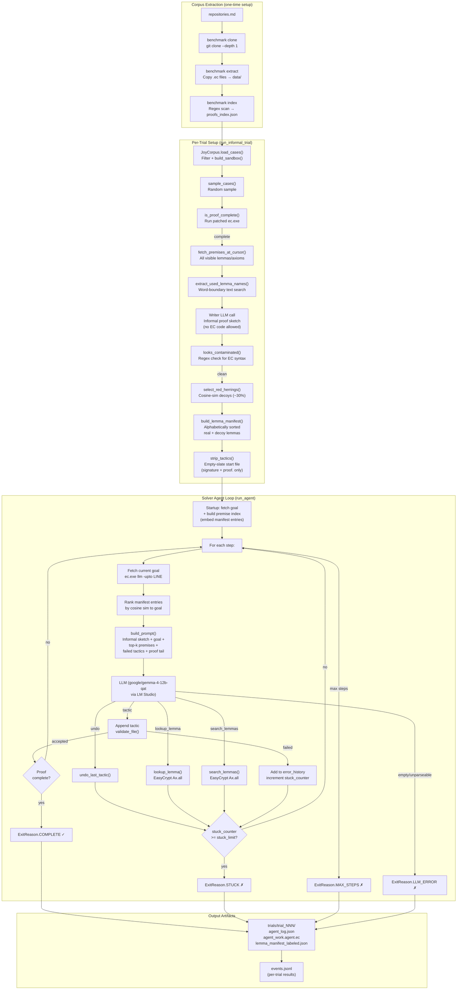

# AI4EC: Agent Harness & Informal Proof Repair — Methodology and Analysis

---

## 1. Corpus Extraction Pipeline

- **Source**: A curated list of EasyCrypt GitHub repositories is maintained in `repositories.md`, divided into `training` and `evaluation` splits.
- **Stage 1 — Clone**: `python -m benchmark clone` does a shallow `git clone --depth 1` of each repo into `.clone/<owner-repo>/`. A `clone_manifest.json` records status for each slug.
- **Stage 2 — Extract**: `python -m benchmark extract` copies every `.ec` file from successfully cloned repos into `data/<slug>/`, preserving relative paths so intra-repo `require` dependencies remain intact. An `extract_manifest.json` is produced.
- **Stage 3 — Index**: `python -m benchmark index` scans every extracted `.ec` file with a comment-aware regex scanner (`ec_scanner.py`) to identify `lemma` and `axiom` declarations. For each declaration it records:
  - `repo_slug`, `file` (relative to `data/`), `line` (1-based), `kind`, `name`, `signature` (multi-line normalized to one line)
  - The output is `data/proofs_index.json`.
- **From index to proof cases**: The `JoyCorpus` corpus provider filters `proofs_index.json` for the `tejasanilshah-the-joy-of-easycrypt` slug and `kind == "lemma"`. For each entry it calls `build_sandbox()`, which:
  - Neutralizes `pragma Goals:` and `print`/`search` commands (these can inflate EasyCrypt's goal output to thousands of tokens)
  - Finds the `proof.`/`qed.` region for that lemma
  - Truncates the file immediately after `qed.` — so the sandbox contains all context the lemma needs, but nothing after it
  - Discards cases with fewer than 2 tactic lines (trivial proofs)
  - Result: a `ProofCase` object with exact 1-based line numbers for the lemma, `proof.`, `qed.`, and every non-blank tactic line
- The sandboxed files are later processed by the agent using the patched EasyCrypt binary described in Section 2.

---

## 2. EasyCrypt Source Patch — Premises Export

EasyCrypt ships a `llm` subcommand designed for non-interactive, machine-friendly batch use. Out of the box it supports `-upto LINE`, which compiles a `.ec` file up to the specified line and prints the current proof goal state to stdout, then exits. This alone is sufficient to retrieve the goal at any proof step. However, it provides no way to dump the globally accessible lemmas and axioms at that same point — information the agent needs to select relevant premises for its next tactic.

A minimal patch to the EasyCrypt OCaml source exposes this capability.

### What was changed

- **`src/ecOptions.ml`** — a new `-premises` flag is registered on the `llm` subcommand:
  ```
  `Spec ("premises", `Flag, "Print all accessible lemmas/axioms after goal state (requires -upto)")
  ```
  The `llm_option` record gains a corresponding `llmo_premises : bool` field. A validation check enforces that `-premises` is only meaningful alongside `-upto` and rejects the combination without it.

- **`src/ecCommands.ml`** — a new function `pp_accessible_lemmas` is added:
  ```ocaml
  let pp_accessible_lemmas (fmt : Format.formatter) =
    let env = EcScope.env (current ()) in
    let ax  = EcEnv.Ax.all
                ~check:(fun _ ax ->
                  EcDecl.is_lemma ax.ax_kind ||
                  EcDecl.is_axiom ax.ax_kind)
                env in
    let ppe = EcPrinting.PPEnv.ofenv env in
    EcPrinting.pp_by_theory ppe EcPrinting.pp_axiom fmt ax
  ```
  This calls `EcEnv.Ax.all` — the internal environment API that enumerates every accessible axiom and lemma — filtered to completed lemmas and axioms only. Results are printed grouped by theory using `pp_by_theory`, which renders each item with its fully-qualified path and type signature using the same pretty-printer as the interactive Emacs mode.

- **`src/ec.ml`** — the `-upto` early-exit block is extended to call `pp_accessible_lemmas` when `-premises` is set, with a fixed sentinel line separating the goal output from the premises output:
  ```ocaml
  if past_upto loc then begin
    T.finalize terminal;
    EcCommands.pp_current_goal_or_noproof ~all:true Format.std_formatter;
    if state.premises then begin
      Printf.printf "(* --- premises --- *)\n";
      EcCommands.pp_accessible_lemmas Format.std_formatter;
      Format.pp_print_flush Format.std_formatter ()
    end;
    exit 0
  end;
  ```
  The sentinel `(* --- premises --- *)` is defined in `integration/agent/config.py` as `PREMISES_SEPARATOR` and is the split point used by the Python integration layer.

### How it is invoked from Python

The agent wrapper in `integration/agent/easycrypt.py` calls the patched binary as:
```
ec.exe llm -upto <LINE> -premises <FILE>.ec
```
`fetch_goal_and_premises()` issues this command as a subprocess and captures stdout. `split_goal_and_premises()` then splits on the `(* --- premises --- *)\n` sentinel to produce a `GoalAndPremises` dataclass with separate `goal` and `premises` strings. The premises block is subsequently parsed by `parse_premises()` in `integration/agent/premises.py` to extract individual `name → signature` pairs for embedding and ranking.

The `-premises` call is made once at agent startup to build the full premise index. During the agent loop each step uses `-upto` alone (without `-premises`) for the cheaper per-step goal fetch, since the premise catalog does not change within a single proof.

### Output format

The premises block is structured as EasyCrypt's standard theory-grouped display:
```
========== TheoryName ==========

lemma_name : <type signature>
...
```
Lemmas are grouped by the theory they belong to and rendered with their fully-qualified names and EasyCrypt-syntax type signatures, exactly as they would appear in the interactive Proof-General interface. This makes the output both human-readable and parseable by the Python layer.

---

## 3. Informal Proof Repair Experiment (`joy-informal-repair`)

### Motivation

- Earlier mutation-repair experiments broke working proofs by altering tactics and asked the model to fix them.
- The informal repair experiment avoids providing any tactic hint at all.
- The concern with "reprove a proof broken for unknown reasons" approaches: without expert review, there is no guarantee an LLM-discovered fix proves the *intended* statement rather than a weakened or vacuous one.
- Solution: always start from a **verified-complete** proof, so the goal is never LLM-manufactured.
- **Why simulate rather than use real broken proofs**: the intended use of this system is for a user to supply a correct proof goal and a set of premises, and have the agent reconstruct the proof. As of now, no EasyCrypt corpus exists that provides broken proofs alongside their correct, verified goals — such a corpus would be needed to test against real failures. Converting a complete, verified proof into an informal sketch is currently the best available simulation of that setting. As collaborators on the team produce genuinely broken proofs, the system can be tested against those directly without any simulation layer.

### Pre-Trial Setup

- `is_proof_complete()` verifies the sandboxed lemma actually checks out against EasyCrypt before the trial begins — if not, the trial is skipped (`not_complete`).
- `fetch_premises_at_cursor()` retrieves all globally visible lemmas/axioms at the `proof.` line via the patched EasyCrypt binary's `-premises` flag.
- `extract_used_lemma_names()` does word-boundary text search of the hidden tactic script against the catalog, identifying which named lemmas appear literally in the tactics.
- `write_informal_proof()` makes a single LLM call (the "writer") with a system prompt that explicitly forbids EasyCrypt syntax, code fences, tactic names, and `qed.` — asking only for a plain-English proof sketch, using the real tactic script as background context only.
- `looks_contaminated()` regex-scans the writer output for leaked EasyCrypt syntax. If triggered, the writer is retried once with a stricter reminder. If still contaminated, the trial is skipped (`writer_leaked_code`).
- `select_red_herrings()` embeds the signatures of actually-used lemmas and ranks the rest of the catalog by cosine similarity, picking the top ~30% as plausible-but-wrong decoy lemmas.
- `build_lemma_manifest()` merges real + decoy lemmas and sorts them alphabetically (so position carries no signal). A labeled version (`lemma_manifest_labeled.json`) is saved for post-hoc analysis but never shown to the solver.
- `strip_tactics()` removes all tactic lines and the trailing `qed.`, leaving just the signature with a bare `proof.` — the empty-slate start file.

### Solver Agent Loop

- The solver receives: the empty-slate `.ec` file, the informal proof sketch, the alphabetically-sorted manifest (real + decoys), and no repair hint.
- Each iteration:
  1. Fetches the current EasyCrypt goal state at the proof cursor via `ec.exe llm -upto LINE`
  2. Embeds the goal text and ranks the manifest premises by cosine similarity to the goal
  3. Builds a prompt with: informal sketch, few-shot examples, current goal, top-k ranked premises, previously failed tactics at this goal, and the last 20 lines of the proof script
  4. Sends prompt to the local LLM (via LM Studio / OpenAI-compatible API)
  5. Parses the JSON response for one of three actions: `tactic`, `undo`, or `lookup_lemma`
  6. Applies/validates the tactic against EasyCrypt; rolls back if it fails
  7. Increments a `stuck_counter` on failures, undos, repeated proof states, and lookups; terminates with `STUCK` if counter reaches the limit
- Termination conditions: `COMPLETE` (no goals remain), `STUCK` (stuck limit hit), `MAX_STEPS` (step budget exhausted), `LLM_ERROR` (unparseable or empty response)

### Few-Shot Examples

The few-shot block (`tactics_fewshot.md`) is included verbatim in every prompt iteration. It maps goal-shape descriptions to canonical tactic choices. A representative sample:

```
## Program logic / procedure stepping

Goal: Hoare or probabilistic Hoare judgment about a procedure call
Tactic: `proc.`

Goal: after `proc`, discharge a straight-line assignment/return
Tactic: `wp; skip; smt().`

Goal: judgment ends in `skip` (empty program)
Tactic: `skip.`

Goal: need to inline a procedure call before reasoning about it
Tactic: `inline *; wp; auto.`

## Automation & rewriting

Goal: `n + 0 = n` (with `n : int`)
Tactic: `by rewrite addr0.`

Goal: simple ring equality over integers
Tactic: `by ring.`

Goal: `0 < n + 1` with axiom `gt0_n : 0 < n`
Tactic: `smt(gt0_n).`

Goal: trivial hypothesis or immediate consequence of context
Tactic: `trivial.`

Goal: normalize a goal via algebraic identities
Tactic: `algebra.`

## Using premises

Goal: apply a known lemma/axiom to reduce the goal
Tactic: `apply addr0.`

Goal: need an intermediate fact before finishing
Tactic: `have h : 0 <= x by smt(). smt(h).`
```

The file covers program-logic stepping, loop tactics, structural/case reasoning, premise application, and automation — approximately 30 patterns in total. Each pattern is a `Goal:` / `Tactic:` pair with no EasyCrypt code in the goal description, so the model must match goal shapes by natural-language description rather than syntax. As discussed in Section 6, this coverage is sufficient for simple tutorial-level proofs but becomes a bottleneck on more complex goals where the right tactic sequence involves multiple steps or nonlinear arithmetic.

---

## 4. Harness Architecture — Mermaid Diagram



---

## 5. Observed Limitations of `google/gemma-4-12b-qat` (Local)

### Context Window / Token Limit

- **Clearest observed failure**: `run-20260703T210112Z` trial 1 (`x_pos`) terminated immediately with `LLM_ERROR: "Context size has been exceeded."` — the prompt was too large for the model even to process a single step.
- **Root cause**: Gemma-4-12b-qat has a limited context window (~8k–32k tokens depending on quantization and LM Studio configuration), and the machine's RAM constrains how much of that window can be actually utilized. The prompt includes: the full few-shot examples block, the informal proof sketch, the current goal text (which can itself be large if EasyCrypt dumps many declarations), the top-k premise list, the error history, and the proof tail.
- **Secondary manifestation**: Even when the model doesn't hard-error on the first step, later steps accumulate more failed tactics in `error_history`, longer proof tails, and more lookup notes — all injected into the prompt — causing context overflow mid-trial.
- `proof_extract.py` already neutralizes `pragma Goals:` and `print`/`search` commands specifically because unchecked EasyCrypt output was "observed in practice to inflate a ~100-character goal into a >15,000-character prompt" — this mitigation was added precisely because of this failure mode.
- The `lm_studio_timeout` is set to 600 seconds per call; several trials took 800–2500 seconds to complete a single inference call, suggesting the local hardware is near its memory ceiling even for inputs that fit within the window.
- Runs using a smaller, faster model configuration (run-20260704T192235Z) completed 4 trials successfully in under 100 seconds each, while larger or slower configurations (run-20260704T010124Z) took 15–40 minutes per trial.

### Runaway Reasoning / Repetitive Chain-of-Thought

- **Observed in multiple runs**: the model produces enormous reasoning blocks that "spin" on the same question without converging on a JSON action — e.g. in trial 24 (`games_quadruple`), the model repeats `"Wait, the goal is Games.t ~ Games.f ..."` dozens of times until the output is truncated.
- Same pattern in trial 4 (`exp_product`): the model loops on `"Wait, let me re-read the goal..."` endlessly, filling its output budget with reasoning and never emitting a JSON object.
- This causes `finish_reason='length'` truncation, leaving `message.content` empty and triggering `LLM_ERROR: "Empty LLM content (message.content was empty and no JSON action was found in reasoning fields; finish_reason='length')"`.
- Observed in `run-20260707T160616Z` (trial 0, `triple3`) and `run-20260706T231618Z` (all 4 trials).
- The model appears to enter "thinking mode" in the reasoning channel and exhaust its token budget before placing the required JSON in the visible content channel.

### Degenerate Tactic Selection (Latest Runs)

From `run-20260709T142319Z` (the current latest), the following tactic failure pattern is visible for lemma `triple3` (Hoare triple: `4 <= x ==> 16 <= x*x`):

- **Step 1** — `proc.` → accepted. Correct first step for a Hoare/procedure goal.
- **Step 2** — `smt().` → failed: `"cannot prove goal (strict)"`. The model correctly identifies this should be dischargeable by SMT, but the local SMT solver (Alt-Ergo) cannot handle `4 <= x ==> 16 <= x * x` directly — it is a nonlinear arithmetic inequality over integers that requires `nlinarith` or manual decomposition.
- **Step 3** — `algebra.` → failed: `"InvalidGoalShape"`. The `algebra` tactic expects equational goals, not inequalities.
- **Step 4** — `by ring.` → failed: `"conclusion must be an equation"`. Same mismatch — `ring` is for equalities only.
- **Step 5** — `left.` → failed: `"cannot apply 'left' on that goal"`. The model mistakes the Hoare-logic pre/post presentation for a propositional disjunction.

**Core problem**: After `proc.`, the goal is a HL/WP-form judgment (`Context : hr: {x : int}, pre = 4 <= x, post = 16 <= x * x`). The model does not recognize it still needs `wp; skip.` to reduce it to an ambient-logic obligation before SMT can discharge it. It skips `wp; skip.` and jumps straight to SMT/ring/algebra on a goal that is still in program-logic form.

- The model also misreads the `pre = 4 <= x` / `post = ...` display as an implication to be reasoned about directly, rather than as EasyCrypt's display of a still-open Hoare judgment requiring further HL tactics.
- The few-shot example in `tactics_fewshot.md` *does* include `wp; skip; smt().` as the canonical pattern for "after `proc`, discharge a straight-line assignment/return", but the model reasons through it without applying it.

### Stuck on Nonlinear Integer Arithmetic

- Several trials (`triple3`, `x0_to_n0_correct`, `flipper_correct_t`, `ln_product`, `exp_product2`) hit `MAX_STEPS` because the required lemmas involve nonlinear integer or real arithmetic that `smt()` with only Alt-Ergo cannot close.
- The model correctly identifies that SMT should work but does not know how to supply specific lemma hints to `smt(lemmaname)` or break the goal into linear sub-goals.

### Slow Inference / Throughput

- Each LLM call takes 2–15 minutes on the local hardware. A 15-step trial can take 30–40 minutes. This severely limits the number of evaluable trials and makes iterative debugging slow.

---

## 6. Prompt Improvement Recommendations

### Fix the Post-`proc` Pattern

- **Problem**: The model skips `wp; skip.` after `proc.` and applies SMT/ring/algebra to a still-open Hoare judgment.
- **Fix**: Add explicit few-shot examples that show the *complete two-step sequence* `proc. wp; skip; smt().` as a single atomic unit for Hoare triples over straight-line procedures. Make it clear that after `proc.` the goal is still in HL form and `wp; skip.` is required before any ambient-logic tactic.
- Example to add:
  ```
  Goal: hoare[ Func.f : P ==> Q ] where f has a single assignment/return
  Step 1: proc.
  Goal is now: { pre = P } straight-line body { post = Q }
  Step 2: wp; skip; smt().
  ```

### Add a Note About `smt()` vs. Nonlinear Arithmetic

- **Problem**: `smt().` fails silently on nonlinear goals (products, squares, logs) that Alt-Ergo cannot decide.
- **Fix**: Add a prompt note explaining that `smt()` relies on the configured SMT backend (Alt-Ergo) and may not close nonlinear goals. Suggest `nlinarith` or decomposing via `have` with intermediate facts, or naming specific lemmas in `smt(lemmaname)`.
- Also clarify the semantic difference between `ring` / `algebra` (equality only) and `smt` (decidable arithmetic), so the model doesn't try `ring` on an inequality.

### Anti-Repetition Instruction for Reasoning

- **Problem**: The model enters a reasoning loop repeating the same observation ("Wait, the goal is X...") until its token budget is exhausted, never emitting a JSON object.
- **Fix**: Add a system-prompt instruction to the LLM call: *"If you find yourself repeating the same observation more than twice, stop, commit to the best available tactic, and emit the JSON action immediately."* Also explicitly call out that the JSON must appear in the visible reply, not just in the reasoning channel.
- The `_json_system_prompt()` already says *"Never put the JSON answer only in reasoning or commentary"* — this warning needs to be stronger and moved to the user message, not just the system prompt, since small local models often weight system prompts less.

### Reduce Prompt Size to Stay Within Context Window

- **Problem**: The prompt is too large for the local model, especially when error history and lookup notes accumulate.
- **Fixes**:
  - Truncate the few-shot examples block to the 5–10 most relevant patterns (currently the full `tactics_fewshot.md` is included every iteration).
  - Cap `error_history` per goal to the 3 most recent failures rather than all of them.
  - Reduce `top_k` premises shown from 10 to 5 for small-context models.
  - Trim `proof_tail_lines` from 20 to 10 for models known to have small windows.
  - Consider exposing a `max_prompt_chars` config guard that truncates non-critical sections if the assembled prompt exceeds a threshold.

### Clarify the Hoare Goal Display Format

- **Problem**: The model misreads `pre = 4 <= x` / `post = 16 <= x * x` in EasyCrypt's goal output as a propositional implication, not a still-open program-logic judgment.
- **Fix**: Add a brief note in the prompt explaining the goal display format:
  > *When you see `pre = P` and `post = Q` in the current goal, the judgment is still in Hoare/program-logic form. You must use `wp`, `skip`, `proc`, `call`, or similar HL tactics to reduce it before ambient-logic tactics like `smt()`, `ring`, or `trivial` can apply.*

### Uninformative EasyCrypt Error Messages and Insufficient Few-Shot Coverage

- **Problem**: EasyCrypt's error messages are typically short and opaque (e.g. `"cannot prove goal (strict)"`, `"InvalidGoalShape"`, `"conclusion must be an equation"`). They identify *what* went wrong at the type/parse level but give no indication of *what a correct tactic should look like* — there is no "did you mean X?" guidance. The model receives these errors and is expected to self-correct, but without knowing the EasyCrypt tactic space well it tends to cycle through a small set of candidates rather than converging on the right approach.
- **Compounding factor**: the current few-shot examples (`tactics_fewshot.md`) cover the most common patterns at a surface level, but the coverage is necessarily thin given the small context window available on the local model. More nuanced patterns — such as the `wp; skip; smt().` sequence for straight-line Hoare triples, the correct handling of nonlinear arithmetic, or the difference between ambient-logic and program-logic goal forms — are either absent or not illustrated with enough concrete variation for a small model to generalize reliably.
- **Context window trade-off**: with a larger context window (as available on frontier models), it would be practical to include substantially more few-shot examples covering a wider range of goal shapes, tactic sequences, and common error/recovery patterns. This is currently not possible on the local hardware without exceeding the token limit. The few-shot block is already one of the largest contributors to prompt size, and trimming it to reduce token usage directly degrades the model's ability to produce correct tactics.
- **Implication for frontier model evaluation**: one of the expected benefits of running experiments on frontier models is exactly this — a larger usable context window allows richer few-shot examples, fuller error history, and more premises to be supplied simultaneously, all of which are bottlenecked on the local setup.

### Consider a Structured Multi-Step Hint

- The informal proof sketch is effective for simple goals but does not convey the *tactic structure* needed (e.g. "first apply `proc.`, then `wp; skip.`, then close with `smt`").
- A possible enhancement: after `proc.` is accepted, dynamically inject a sub-hint into the prompt like "The goal is now a straight-line HL obligation — use `wp; skip; smt().`." This would not require revealing the original tactics and could be triggered by goal-shape recognition.

---

## 7. Next Steps

### Migrate to a Frontier or High-Capacity Model

- The local `google/gemma-4-12b-qat` model has been useful for establishing that the harness pipeline is functionally correct end-to-end, but hardware memory constraints impose a hard ceiling on context window utilization, inference speed, and model capability that makes it unsuitable for sustained evaluation.
- The next step is to run experiments against **DeepSeek-V3** (or a comparable frontier-scale model such as **GLM-4.5**) via their respective APIs. These models eliminate the hardware bottleneck entirely: they operate with context windows of 64k–128k tokens, have substantially stronger mathematical and formal-reasoning capability, and return completions in seconds rather than minutes.
- This directly addresses the three most significant observed failure modes: context overflow, runaway reasoning chains that exhaust the token budget before emitting a JSON action, and insufficient EasyCrypt tactic knowledge to self-correct from opaque error messages.
- The harness requires no structural changes to switch models — only the `--llm-model` flag and API base URL need to be updated.

### Integrate the Broken Proof Corpus from Collaborators

- The informal proof simulation (converting complete proofs into plain-English sketches) was adopted specifically because no corpus of genuinely broken proofs with verified correct goals existed at the time of this work.
- **Update**: a first genuinely broken corpus is now integrated — `elgamal-broken-repair`, over `derens99/ElGamal-proof`'s Hashed ElGamal development (`data/derens99-ElGamal-proof/hashedelgamal.ec`, 2020), which no longer compiles against the vendored EasyCrypt release. See `integration/experiment/corpora/elgamal.py` and the "Genuinely broken proofs" section of `integration/experiment/README.md`.
- This removes the simulation layer entirely for that corpus: the agent is given the corpus's own broken tactic script (not a writer-LLM paraphrase), the goal as written in the source, and the full premise catalog, and asked to reconstruct a correct proof.
- Two distinct kinds of breakage had to be disentangled: (1) mechanical syntax/API drift (renamed theories, dropped syntax, changed restriction-set spelling) that has nothing to do with proof reasoning and is ported once, offline, preserving line numbers; and (2) genuinely broken tactic scripts inside specific lemmas (confirmed empirically post-port: `INDCPA_HEG_G1` and `G1_G2_eq` still fail tactic-by-tactic), which is what the harness actually evaluates.
- "Assume everything the target depends on is already proven" is implemented by replacing every *prior* lemma's proof body with `admit.` before the target (`admit_prior_lemmas`), since the corpus's lemmas are a strictly linear sequence — this is a safe over-approximation of the target's real dependency set, and EasyCrypt does not distinguish "proven" from "admitted" when consuming a fact.
- Unlike `joy-informal-repair`, this spec has no red-herring/curated lemma manifest: premises are ranked against the full ambient catalog (same as `joy-tactic-repair`), so the measurement is effectiveness/efficiency at repairing a genuinely broken proof, not effectiveness at using a user-curated "likely useful" lemma set.
- Remaining future work: only `hashedelgamal.ec` (15 lemmas) is wired up; the corpus's `encryption/` SymEnc-from-PRF tutorial, the official EasyCrypt `examples/elgamal*.ec`, and any further collaborator-contributed broken corpora would each need their own `CorpusProvider` following the same pattern.

### Improve Prompts and Error Feedback

- As detailed in Section 5, several concrete prompt improvements have been identified: richer few-shot examples for post-`proc` sequences, an explanatory note about the Hoare goal display format, SMT/nonlinear arithmetic guidance, stronger anti-repetition instructions, and dynamic sub-hints triggered by goal shape.
- With a frontier model and a larger context window, most of the prompt compression trade-offs from Section 5 become unnecessary — `error_history`, `top_k` premises, and few-shot examples can all be supplied at full fidelity.
- A structured feedback mechanism for EasyCrypt errors should also be explored: rather than passing the raw error string directly, map known error patterns (e.g. `"cannot prove goal (strict)"`, `"InvalidGoalShape"`) to human-readable explanations of what the error means and what class of tactic is likely needed next.

### Move Towards Production EasyCrypt Codebases

- The current corpus, *The Joy of EasyCrypt*, is a pedagogical tutorial deliberately designed to introduce beginners to EasyCrypt concepts through simple, small lemmas. It was chosen as a minimal baseline to establish that the methodology is feasible before investing in harder problems.
- The proofs in the Joy corpus are largely trivial from a tactic-complexity standpoint: many are discharged in 1–3 steps (`proc. wp; skip; smt().`), use no non-trivial lemma dependencies, and involve only the most elementary EasyCrypt constructs.
- The real target for this work is production cryptographic verification code — EasyCrypt proofs from active research projects that involve game-based security reductions, probabilistic Hoare logic, module abstractions, and multi-step equivalence arguments. These are significantly harder and are where automated proof assistance would have genuine research value.
- Transitioning the evaluation corpus to production-level `.ec` files (e.g. from the EasyCrypt standard library, Jasmin-verified code, or published cryptographic protocol proofs) is the natural next step once the pipeline is validated at the tutorial level. This will require expanding the few-shot example set, tuning the red-herring selection strategy for larger premise catalogs, and likely introducing more sophisticated goal-shape routing in the prompt construction.
