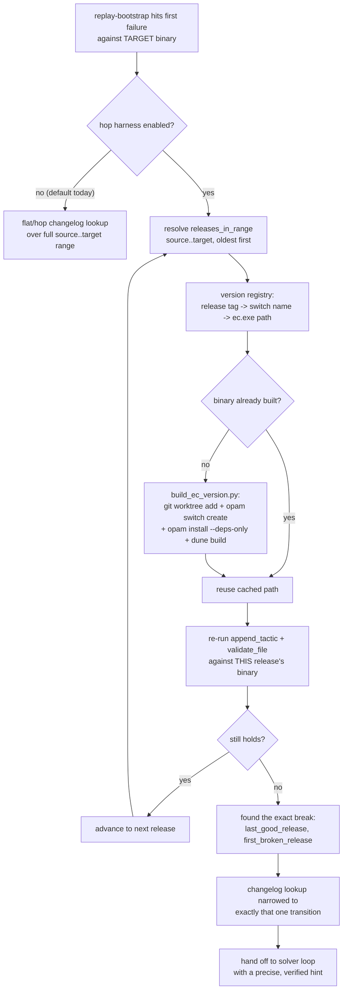

> **Status, 2026-08-04 — implemented.** `integration/experiment/ec_versions.py`
> (registry + lazy, cached, LRU-bounded provisioning) and
> `integration/experiment/version_hop.py` (localization) are written and
> tested; `--version-hop` wires them into `replay_bootstrap` as the opt-in
> pre-step §5 describes. Three places where the implementation departs from
> what is written below, each for a reason the design could not have known:
>
> 1. **Binary search, not the oldest-to-newest walk in the flowchart.** A build
>    is minutes; over the 14-release catalog bisection is ~4 probes against up
>    to 14. It assumes a tactic breaks once and stays broken — the same
>    assumption `git bisect` makes — so `--version-hop-strategy linear` keeps
>    the exhaustive answer available and the result records which was used.
> 2. **Probes are three-valued, not yes/no.** §3 frames each check as "does the
>    tactic still hold". Against a four-year-old EasyCrypt most checks are
>    neither: a 2020 proof repaired to load against r2026.06 requires FMap, and
>    FMap did not exist before r2024.09, so the file does not LOAD at r2023.09
>    and the tactic is never reached. Counting that as "broken here" puts the
>    boundary at the wrong release. `ec_errors` (W4.1, written after this plan)
>    separates them: a pre-proof failure is INCONCLUSIVE and is excluded from
>    the search rather than counted as either answer.
> 3. **Tags are resolved from the existing clone, not `git ls-remote`.** §2
>    step 1 proposes querying upstream. The fork was cloned from upstream and
>    already carries all 14 `rYYYY.MM` tags, so the network call would only add
>    a failure mode for information on disk.
>
> The option-(a) recommendation in §1 held up exactly as predicted: `-premises`
> exists only on the fork's HEAD (`src/ecOptions.ml`, `src/ec.ml`) and not at
> any release tag, and hop validation only ever runs `llm -lastgoals`, so no
> patch rebasing is needed.

# EasyCrypt version-hopping infrastructure

## Why this is a different thing from changelog-order hopping

Two "hopping" ideas were raised together and are easy to conflate:

1. **Hop through the *changelog lookup*, in release order.** This only needs the
   single EasyCrypt binary already built (`integration/extern/easycrypt` via the
   `cs846` switch) — it changes how `integration/agent/repair_hints.py` *reads*
   `proof_corpus/output/changelog.yaml`, not what EasyCrypt binary anything runs
   against. **This is implemented** (see `get_changelog_repair_hints_by_release`
   in `integration/agent/repair_hints.py`) — out of scope for this doc.

2. **Hop through *EasyCrypt binaries*, one per release, and re-verify at each
   step.** This is what this document describes. It needs N separately built
   EasyCrypt binaries — one compiled at (or near) each changelog-tracked release
   tag — and a harness that actually re-runs tactic validation against each one
   in turn. This is genuinely new infrastructure, not a refinement of existing
   code, and is **not implemented**.

## The problem this solves

`integration/experiment/repair_bootstrap.py::run_replay_bootstrap_trial` replays
a lemma's original tactic script against **one** EasyCrypt build and stops at the
first tactic that returns nonzero from `validate_file`. At that point,
`repair_hints.get_changelog_repair_hints_by_release` scopes the changelog lookup
to `(source_ec_version, target_ec_version]` — the caller-supplied, unverified
endpoints of however many releases the corpus might span (potentially a dozen or
more). For an old proof, this leaves two related gaps:

- **No localization of *which* release actually broke the tactic.** A tactic
  that fails against the target binary might have broken at the very next
  release after `source_ec_version`, or only in the very last release before
  `target_ec_version` — the single binary only tells you "broken at target,"
  not "broken starting at release X." The changelog-order hop (item 1 above)
  improves *which hints get shown first*, but it's still guessing based on
  identifier-overlap, not verified against what the code actually did at each
  release.
- **No way to confirm a changelog hint's suggested fix is actually correct for
  the release it claims to describe**, short of trying it against the final
  target and seeing if the whole rest of the proof also happens to hold. If a
  hint's `repair_hint` text describes a fix that was itself superseded by a
  *later* release's change, the only way to know is to actually run the fixed
  tactic against an intermediate build.

Version-hopping infrastructure would let the bootstrap **bisect**: walk
`releases_in_range(source, target)` in order, and for each release, build (or
reuse a cached build of) that release's EasyCrypt binary, then re-run the exact
same `ProofFile.append_tactic` + `validate_file` check used today — but pointed
at that release's binary — to find the precise `(last_good_release,
first_broken_release]` boundary. The changelog lookup then narrows to exactly
that one transition instead of the whole span.

## Proposed architecture



### 1. Version registry

A small JSON manifest, e.g. `integration/extern/ec_version_registry.json`:

```json
{
  "fork_repo": "https://github.com/KevinLeeFM/easycrypt.git",
  "versions": {
    "r2025.02": {
      "commit": "<resolved sha, nearest ancestor tag on the fork or upstream>",
      "opam_switch": "cs846-ec-r2025.02",
      "worktree_path": "integration/extern/.ec_versions/r2025.02",
      "binary_path": "integration/extern/.ec_versions/r2025.02/_build/default/src/ec.exe",
      "built_at": "2026-07-29T00:00:00Z"
    }
  }
}
```

Resolution: a release tag needs a commit to check out. The fork
(`KevinLeeFM/easycrypt`, pinned in `.gitmodules`) carries the `-premises` patch on
top of *some* upstream commit; upstream release tags (`r2025.02` etc.) exist on
`EasyCrypt/easycrypt`, not necessarily on the fork. Two sub-options, both
needing a decision before implementation:

- **(a) Build upstream-tagged binaries** (no `-premises` patch) for every
  release except the target/current one (which stays the patched fork). This
  is simpler but means the `-premises` flag — and therefore
  `fetch_goal_and_premises` — isn't available for intermediate versions; the
  hop harness would need a narrower EasyCrypt interaction than the full agent
  (just goal/tactic validation, which doesn't need `-premises`).
- **(b) Rebase the `-premises` patch onto each release tag.** More consistent
  interaction surface, but is real, per-version maintenance work (a patch that
  applies cleanly at `r2026.07` may not apply cleanly at `r2022.04`).

Recommend (a) for a first version: the hop harness only needs
`llm -upto N FILE.ec` (no `-premises`) to validate a tactic, which is
`ecCommands.ml`'s pre-existing, unpatched behavior — so upstream tags need no
patch rebasing at all.

### 2. Per-version build script

`integration/scripts/build_ec_version.py --version r2025.02`:

1. Resolve `r2025.02` to a commit (via `git ls-remote --tags` against upstream
   `EasyCrypt/easycrypt`, matching the same `VERSION_TAG_RE` pattern
   `proof_corpus/scripts/compute_exposure_score.py` already uses).
2. `git worktree add integration/extern/.ec_versions/r2025.02 <commit>` against
   the **existing** fork clone at `integration/extern/easycrypt/.git` (worktrees
   share one object store — this is the single most important cost control: a
   naive `git clone` per version would multiply disk usage and clone time by N
   for no benefit, since every version's history is a strict subset of the same
   repository).
3. `opam switch create cs846-ec-r2025.02 4.14.1` (idempotent — skip if it
   already exists), matching the same OCaml/dependency constraints already
   confirmed working for `cs846`.
4. `opam install --deps-only .` + `dune build` inside the worktree, same as the
   existing `cs846` setup.
5. Record the result in the version registry (§1).

This mirrors, step for step, the manual setup already done once for `cs846` —
the only new part is doing it N times, keyed by release tag, with worktree
sharing instead of full clones.

### 3. Hop harness

A new function, e.g. `integration/experiment/version_hop.py::bisect_break_version`,
taking the same inputs as `run_replay_bootstrap_trial`'s per-tactic loop
(`ProofFile`, one tactic, an `AgentConfig`-shaped binary path override) plus a
chronologically-ordered list of `(version, binary_path)` pairs. For each
version in order: build (or reuse) that binary, point a *throwaway*
`AgentConfig.easycrypt_bin` at it, run the same `validate_file` check used
today, and stop at the first version where it fails. This reuses
`integration/agent/easycrypt.py::validate_file` verbatim (it already just takes
a `config` with a `bin_path` field — no change needed there) — the only new
code is the version-iteration loop and the registry lookup.

### 4. Cost guardrails

Building even a handful of EasyCrypt binaries is expensive (each is a full
OCaml project build with `why3`/`zarith`/etc., observed to take several minutes
per switch during the `cs846` setup). This must be:

- **Lazy**: only build a version the hop harness actually needs to check, never
  the whole changelog's release list up front.
- **Cached**: once built, keep the binary and switch around (the registry file
  is exactly this cache's index) — never rebuild an already-registered version.
- **Bounded**: cap how many per-version switches/worktrees stay provisioned at
  once (e.g. LRU-evict the least-recently-used version's switch/worktree if a
  configurable cap is exceeded), since opam switches are not free to keep
  around indefinitely (each is a full OCaml install, hundreds of MB).

### 5. Integration point

The hop harness is additive: `run_replay_bootstrap_trial` keeps working exactly
as it does today (single binary, single changelog-range lookup) unless a new
opt-in flag enables the bisection pre-step. This mirrors how `replay_bootstrap`
itself was added as a new `ExperimentSpec.replay_bootstrap` variant alongside
the existing `broken_formal`/`informal`/mutation modes, rather than changing
their behavior.

## Out of scope (explicit)

- **This document describes a design, not an implementation.** No code in this
  plan has been written; see the `todos` above for the build order.
- **Patch-rebasing `-premises` onto every intermediate release** is explicitly
  deferred (§1, option (b)) — the first version should validate tactics without
  it.
- **Building binaries for every changelog-tracked release eagerly** is
  explicitly rejected in favor of lazy, on-demand, cached provisioning (§4) —
  the full changelog spans 14+ releases; building all of them for a single
  repair attempt would dwarf the cost of the repair itself.
- **Changelog-order hopping** (item 1 in "why this is different") is already
  implemented independently of this infrastructure and does not depend on it.
