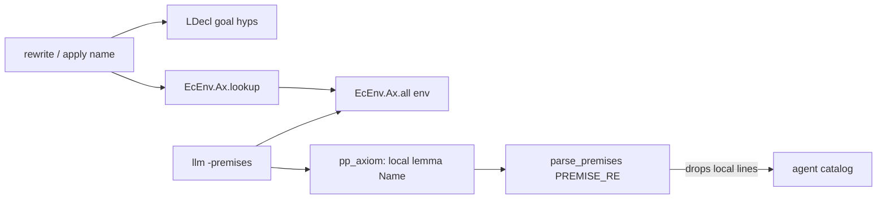

# Fix premise discovery to match tactic name resolution

## What EasyCrypt actually does

Tactic name resolution for `rewrite` / `apply` (and similar) is [`lookup_named_psymbol`](integration/extern/easycrypt/src/ecProofTerm.ml):

```451:461:integration/extern/easycrypt/src/ecProofTerm.ml
let lookup_named_psymbol (hyps : LDecl.hyps) ~hastyp fp =
  match fp with
  | ([], x) when LDecl.hyp_exists x hyps && not hastyp ->
      ...
  | _ ->
    match EcEnv.Ax.lookup_opt fp (LDecl.toenv hyps) with
    | Some (p, ({ EcDecl.ax_spec = fp } as ax)) ->
        Some (`Global p, (ax.EcDecl.ax_tparams, fp))
```

Order: **goal hypotheses** (`LDecl`) first, then **`EcEnv.Ax.lookup`** on the ambient env.

The agent’s premises dump is already that ambient catalog:

```1100:1108:integration/extern/easycrypt/src/ecCommands.ml
let pp_accessible_lemmas (fmt : Format.formatter) =
  let env = EcScope.env (current ()) in
  let ax  = EcEnv.Ax.all
              ~check:(fun _ ax ->
                EcDecl.is_lemma ax.ax_kind ||
                EcDecl.is_axiom ax.ax_kind)
              env in
```

`Ax.all` does **not** filter `ax_loca`. While a section is open, `local lemma` items are in the same table tactics use. Confirmed on trial_000: `easycrypt llm -upto … -premises` contains `local  lemma INDCPA_HEG_G1`, `G3_true`, etc., and `rewrite -(G3_true &m).` still typechecks.



**Conclusion:** do not replace `Ax.all` with a different EasyCrypt API for section locals. The dump already matches tactic ambient resolution. The bug is agent-side parsing.

## Root cause

[`pp_axiom`](integration/extern/easycrypt/src/ecPrinting.ml) prefixes locality:

- `string_of_locality` → `"local "` / `"declare "`
- joined with kind via `pp_list " "` → lines like `local  lemma G3_true: …` (double space)

[`PREMISE_RE`](integration/agent/premises.py) only matches lines starting with `lemma`/`axiom`:

```22:22:integration/agent/premises.py
PREMISE_RE = re.compile(r"^(lemma|axiom)\s+(\w+)[^:]*:\s*(.+)$")
```

Raw dump: 8 local lemmas present. After `parse_premises`: **0** of them in the catalog (2583 other entries). That matches the run: substring search `INDCPA` → no matches.

## Planned change (agent only)

1. **Widen `PREMISE_RE`** in [`integration/agent/premises.py`](integration/agent/premises.py) to accept the `pp_axiom` prefix shape:
   - optional leading `local` / `declare`
   - `lemma` / `axiom`
   - optional `nosmt`
   - optional `[tags…]`
   - basename + optional type-params before `:`
   - keep capturing `kind` + `name` + statement for catalog text

   Example target pattern (finalize in implementation):

   ```python
   PREMISE_RE = re.compile(
       r"^(?:(?:local|declare)\s+)?"
       r"(lemma|axiom)(?:\s+nosmt)?"
       r"(?:\s+\[[^\]]*\])?"
       r"\s+(\w+)[^:]*:\s*(.+)$"
   )
   ```

2. **Preserve locality in catalog text** when present (e.g. `[Top] local lemma G3_true: …`) so the model can see they are section-local; keys stay `Theory.basename` as today (`Top.G3_true`), matching how tactics accept bare / qualified names.

3. **Unit tests** in [`integration/tests/test_agent.py`](integration/tests/test_agent.py):
   - parse `local  lemma` / `declare  lemma` / `lemma nosmt` lines under a theory header
   - keys appear as `Top.INDCPA_HEG_G1` etc.
   - existing samples still pass

4. **Smoke check** against the existing ElGamal trial_000 `agent_start.ec` dump (or a tiny fixture): after the fix, `parse_premises` must include `INDCPA_HEG_G1`, `G1_G2`, `G3_true`, etc.

5. **Docs**: one short note in [`integration/experiment/README.md`](integration/experiment/README.md) (elgamal / agent extensions) that section-local lemmas are in `llm -premises` / Ax.all while the section is open, and the agent catalog must parse the `local` prefix.

## Out of scope (explicit)

- **No EasyCrypt OCaml change** for this bug — `pp_accessible_lemmas` already dumps the right set.
- **Goal hypotheses** (`have` / `move =>` names) are tactic-visible via `LDecl` but never in Ax.all. That is a separate enrichment (parse goal hyps into the lookup list). Not required to fix the ElGamal local-lemma discovery failure.
