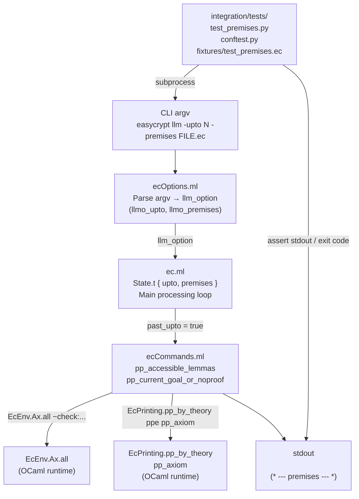

# Design Document — `easycrypt-premises-export`

## Overview

This feature patches the EasyCrypt proof assistant (OCaml source under
`integration/extern/easycrypt/src/`) to add a `-premises` flag to the existing `llm`
subcommand. When invoked as `easycrypt llm -upto LINE -premises FILE.ec`, the tool
prints the current proof-goal state to stdout (existing behaviour) followed by a
separator line and then a listing of every globally accessible lemma and axiom in
the loaded environment. An LLM agent can thus retrieve the full proof vocabulary in
a single subprocess call rather than issuing interactive search queries.

The change touches exactly four source units:

| Unit | Role |
|---|---|
| `src/ecOptions.ml` | CLI flag registration and option record |
| `src/ecCommands.ml` / `src/ecCommands.mli` | New printer exposed as module API |
| `src/ec.ml` | Top-level dispatch — state field + output at `-upto` exit point |
| `integration/tests/` | New pytest test suite + fixture files |

---

## Architecture

### Component Interaction



### Data Flow at the `-upto` Exit Point

```
past_upto(loc) = true
  │
  ├─ pp_current_goal_or_noproof ~all:true stdout_fmt
  │    (existing goal state output — unchanged)
  │
  └─ if state.premises then
       │  Printf.printf "(* --- premises --- *)\n"
       │  pp_accessible_lemmas stdout_fmt
       │  flush stdout_fmt
       └─ exit 0
     else
       exit 0   (* unchanged path *)
```

---

## Components and Interfaces

### 1. `src/ecOptions.ml`

#### 1a. Record field addition — `llm_option`

Add `llmo_premises : bool` to the existing record:

```ocaml
and llm_option = {
  llmo_input     : string;
  llmo_provers   : prv_options;
  llmo_lastgoals : bool;
  llmo_upto      : (int * int option) option;
  llmo_premises  : bool;           (* NEW *)
}
```

#### 1b. CLI spec registration — `xp_commands`

In the `"llm"` entry of `xp_commands`, add the flag spec immediately after the
existing `"upto"` spec:

```ocaml
("llm", "LLM-friendly batch compilation", [
  `Group "loader";
  `Group "provers";
  `Spec ("lastgoals", `Flag,   "Print last unproved goals on failure");
  `Spec ("upto",      `String, "Compile up to LINE or LINE:COL and print goals");
  `Spec ("premises",  `Flag,   "Print all accessible lemmas/axioms after goal state (requires -upto)");
  (* NEW ↑ *)
]);
```

#### 1c. Parsing function — `llm_options_of_values`

```ocaml
let llm_options_of_values ini values input =
  { llmo_input     = input;
    llmo_provers   = prv_options_of_values ini values;
    llmo_lastgoals = get_flag "lastgoals" values;
    llmo_upto      = parse_upto values;
    llmo_premises  = get_flag "premises" values; }   (* NEW *)
```

No other changes to `ecOptions.ml` are required.

---

### 2. `src/ecCommands.ml`

#### 2a. New top-level function `pp_accessible_lemmas`

Add after the existing `pp_all_goals` definition (near the bottom of the file):

```ocaml
(* -------------------------------------------------------------------- *)
let pp_accessible_lemmas (fmt : Format.formatter) =
  let env = EcScope.env (current ()) in
  let ax  = EcEnv.Ax.all
              ~check:(fun _ ax ->
                EcDecl.is_lemma ax.ax_kind ||
                EcDecl.is_axiom ax.ax_kind)
              env in
  let ppe = EcPrinting.PPEnv.ofenv env in
  EcPrinting.pp_by_theory ppe EcPrinting.pp_axiom fmt ax
```

Design notes:
- Uses exactly the same `EcEnv.Ax.all ~check:...` pattern as `HiPrinting.pr_axioms`,
  but widens the predicate from `is_axiom`-only to `is_lemma || is_axiom`.
- Calls `EcPrinting.pp_by_theory ppe EcPrinting.pp_axiom` — the same code path
  used by the interactive `print axioms` command.
- Does not catch exceptions; callers receive any exception raised by the environment
  lookup (satisfying Requirement 2.2).
- Takes a `Format.formatter` argument rather than operating on `stdout` directly,
  keeping it testable and reusable.

#### 2b. Interface file — `src/ecCommands.mli`

Add the declaration in the `pp_*` section (after `pp_all_goals`):

```ocaml
(* -------------------------------------------------------------------- *)
val pp_current_goal : ?all:bool -> Format.formatter -> unit
val pp_current_goal_or_noproof : ?all:bool -> Format.formatter -> unit
val pp_maybe_current_goal : Format.formatter -> unit
val pp_all_goals : unit -> string list
val pp_accessible_lemmas : Format.formatter -> unit   (* NEW *)
```

---

### 3. `src/ec.ml`

#### 3a. `State.t` record — add `premises` field

Inside the `module State = struct` local definition, extend the record type:

```ocaml
type t = {
  (*---*) prvopts     : prv_options;
  (*---*) input       : string option;
  (*---*) terminal    : T.terminal lazy_t;
  (*---*) interactive : bool;
  (*---*) eco         : bool;
  (*---*) gccompact   : int option;
  (*---*) docgen      : bool;
  (*---*) outdirp     : string option;
  (*---*) upto        : (int * int option) option;
  (*---*) premises    : bool;       (* NEW *)
  mutable trace       : trace1 list option;
}
```

#### 3b. Initialise `premises` in the `Llm` branch

In the `| \`Llm llmopts -> begin ... end` branch of `let state : State.t = ...`,
add the field initialiser:

```ocaml
| `Llm llmopts -> begin
    (* ... existing file-extension check and terminal construction ... *)
    { prvopts     = llmopts.llmo_provers
    ; input       = Some name
    ; terminal    = terminal
    ; interactive = false
    ; eco         = true
    ; gccompact   = None
    ; docgen      = false
    ; outdirp     = None
    ; upto        = llmopts.llmo_upto
    ; premises    = llmopts.llmo_premises    (* NEW *)
    ; trace       = None }
  end
```

All other branches (`` `Cli ``, `` `Compile ``, `` `DocGen ``, `` `Config ``,
`` `Why3Config ``, `` `Runtest ``) must also gain a `premises = false` field to
keep the record exhaustive. Each is initialised to `false`.

#### 3c. `-premises` without `-upto` validation

Add a guard after `let state : State.t = ...` is fully constructed and before
entering the main loop:

```ocaml
(* Validate: -premises requires -upto *)
if state.premises && Option.is_none state.upto then begin
  Format.eprintf
    "easycrypt llm: -premises requires -upto; \
     please supply -upto LINE or -upto LINE:COL@.";
  exit 1
end;
```

This satisfies Requirement 1.4 (non-zero exit, non-empty stderr).

#### 3d. The `past_upto` exit point — extended output

The existing code in the main loop:

```ocaml
if past_upto loc then begin
  T.finalize terminal;
  EcCommands.pp_current_goal_or_noproof ~all:true Format.std_formatter;
  exit 0
end;
```

Replace with:

```ocaml
if past_upto loc then begin
  T.finalize terminal;
  EcCommands.pp_current_goal_or_noproof ~all:true Format.std_formatter;
  if state.premises then begin
    Printf.printf "(* --- premises --- *)\n";
    EcCommands.pp_accessible_lemmas Format.std_formatter;
    Format.pp_print_flush Format.std_formatter ()
  end;
  exit 0
end;
```

Design notes:
- `Printf.printf` is used for the separator because it writes the literal bytes
  directly; the separator is ASCII-only and does not go through OCaml's `Format`
  box model, avoiding any risk of line-wrapping.
- `Format.pp_print_flush` is called before `exit 0` to ensure all buffered
  pretty-printer output is flushed to stdout.
- When `state.premises = false`, behaviour is identical to the unpatched tool
  (Requirement 3.4).

---

## Data Models

### `llm_option` (in `ecOptions.ml`)

```
llm_option = {
  llmo_input     : string                     -- path to .ec file
  llmo_provers   : prv_options               -- prover configuration
  llmo_lastgoals : bool                      -- print last goals on failure
  llmo_upto      : (int * int option) option -- stop line (and optional col)
  llmo_premises  : bool                      -- NEW: print premises block
}
```

### `State.t` (local module in `ec.ml`)

```
State.t = {
  prvopts     : prv_options
  input       : string option
  terminal    : T.terminal lazy_t
  interactive : bool
  eco         : bool
  gccompact   : int option
  docgen      : bool
  outdirp     : string option
  upto        : (int * int option) option
  premises    : bool                         (* NEW *)
  trace       : trace1 list option  (mutable)
}
```

### Stdout output format (when `-premises` and `-upto` are active)

```
<goal state section>
(* --- premises --- *)
<premises section formatted by EcPrinting.pp_by_theory>
```

The separator is the exact 25-byte ASCII sequence `(* --- premises --- *)\n`.
Splitting on the first occurrence of this sequence divides stdout into exactly
two parts: the goal section (may be empty if no proof is active) and the
premises section (may be empty if no lemmas or axioms are loaded).

---

## Correctness Properties

*A property is a characteristic or behavior that should hold true across all valid
executions of a system — essentially, a formal statement about what the system should
do. Properties serve as the bridge between human-readable specifications and
machine-verifiable correctness guarantees.*

---

### Property 1: `llmo_premises` reflects the presence of `-premises`

*For any* valid `llm` argument vector, `llmo_premises` in the resulting `llm_option`
record SHALL equal `true` if and only if `-premises` appears in the vector, and
`false` otherwise.

**Validates: Requirements 1.1, 1.3**

---

### Property 2: `pp_accessible_lemmas` includes every lemma and axiom

*For any* EasyCrypt environment, calling `pp_accessible_lemmas` SHALL produce output
that contains a representation of every entry `(path, ax)` for which
`EcDecl.is_lemma ax.ax_kind || EcDecl.is_axiom ax.ax_kind` is `true`, and SHALL NOT
include entries for which the predicate is `false`.

**Validates: Requirements 2.2, 2.3**

---

### Property 3: Goal state is always emitted at the `-upto` exit point

*For any* `.ec` file and any stop-line at which `past_upto` fires, the portion of
stdout BEFORE the separator (or the full stdout when `-premises` is absent) SHALL
contain either the proof goal state or the string "No active proof.", regardless of
whether `-premises` is set.

**Validates: Requirements 3.2**

---

### Property 4: Separator is absent when `-premises` is not set

*For any* `.ec` file and any valid stop-line, invoking `easycrypt llm -upto LINE
FILE.ec` WITHOUT `-premises` SHALL produce stdout that does not contain the byte
sequence `(* --- premises --- *)`.

**Validates: Requirements 3.4, 5.6**

---

### Property 5: stdout splits into exactly two parts on the separator

*For any* `.ec` file compiled with `-premises -upto LINE`, splitting the full stdout
on the first occurrence of `(* --- premises --- *)\n` SHALL yield exactly two
substrings (goal section and premises section), with no further occurrences of the
separator sequence in the premises section.

**Validates: Requirements 4.1**

---

### Property 6: Named lemmas appear in the premises block

*For any* `.ec` file that declares at least one named lemma and is compiled with
`-premises -upto LINE` (where LINE is past the lemma declaration), the premises
section (the part of stdout after the separator) SHALL contain the lemma's name.

**Validates: Requirements 4.2, 5.5**

---

## Error Handling

### `-premises` without `-upto`

Detected immediately after `State.t` is constructed, before the main loop.
Writes to `stderr` and exits with code 1.

```
easycrypt llm: -premises requires -upto; please supply -upto LINE or -upto LINE:COL
```

### Compilation failures

Unchanged from current behaviour. If the file fails to compile before reaching
the stop-line, the tool exits with code 1 and the error is written to stderr.
The premises block is never printed on a compilation error because the
`past_upto` exit point is only reached on successful processing of each command.

### `EcEnv.Ax.all` exceptions

`pp_accessible_lemmas` does not catch exceptions. Any internal error in the
environment enumeration propagates up to the main loop's `try … with e -> …`
handler, which calls `T.finish (\`ST_Failure …)` and exits with code 1.

### Stdout flush

`Format.pp_print_flush Format.std_formatter ()` is called before `exit 0` at
the `past_upto` exit point to ensure the pretty-printer buffer is drained even
if `exit` bypasses atexit handlers.

---

## Testing Strategy

### Build Verification

Rebuild the EasyCrypt fork after making the OCaml changes:

```bash
cd integration/extern/easycrypt
dune build
```

The produced binary is at
`integration/extern/easycrypt/_build/default/src/ec.exe`.

Compilation success verifies Requirements 2.1, 2.4, and 3.1 (type-level checks).

### Unit / Integration Tests (pytest)

Tests live under `integration/tests/` and are run with:

```bash
cd integration/tests
pytest test_premises.py -v
```

All tests use a subprocess timeout of 120 seconds (Requirement 5.4).

#### File layout

```
integration/tests/
├── conftest.py                    # binary-path fixture
├── test_premises.py               # test module
└── fixtures/
    └── test_premises.ec           # EasyCrypt fixture file
```

#### `conftest.py`

```python
import os
import pathlib
import pytest

REPO_ROOT = pathlib.Path(__file__).resolve().parents[2]  # AI4EC/integration -> AI4EC

@pytest.fixture(scope="session")
def easycrypt_bin():
    """Resolve the easycrypt binary path.

    Prefers the EASYCRYPT environment variable; falls back to the dune build
    output path relative to the repository root.
    """
    env_path = os.environ.get("EASYCRYPT")
    if env_path:
        return pathlib.Path(env_path)
    derived = (
        REPO_ROOT
        / "integration"
        / "extern"
        / "easycrypt"
        / "_build"
        / "default"
        / "src"
        / "ec.exe"
    )
    return derived
```

#### `integration/tests/fixtures/test_premises.ec`

```easycrypt
require import AllCore.

lemma myfirstlemma (n : int) : n + 0 = n.
proof. by ring. qed.

lemma mysecondlemma (n : int) : 0 + n = n.
proof. by ring. qed.

(* STOP_LINE is the line number of this comment: 10 *)
```

The stop-line value used in tests is `10` (the blank comment line after the
second `qed`, before which no command starts). Adjust to match the actual line
number when the file is committed.

#### `test_premises.py` — test functions

**Property 4 & 5.6 — no separator without `-premises`:**

```python
def test_no_separator_without_premises_flag(easycrypt_bin, tmp_path):
    """For any .ec file and valid stop-line, stdout must not contain the
    separator when -premises is absent (Property 4)."""
    fixture = FIXTURES / "test_premises.ec"
    result = subprocess.run(
        [str(easycrypt_bin), "llm", "-upto", str(STOP_LINE), str(fixture)],
        capture_output=True, text=True, timeout=120,
    )
    assert result.returncode == 0
    assert SEPARATOR not in result.stdout
```

**Property 5 — stdout splits into exactly two parts:**

```python
def test_stdout_splits_into_two_parts(easycrypt_bin):
    """Splitting stdout on the separator yields exactly two substrings
    (Property 5)."""
    fixture = FIXTURES / "test_premises.ec"
    result = subprocess.run(
        [str(easycrypt_bin), "llm", "-upto", str(STOP_LINE), "-premises", str(fixture)],
        capture_output=True, text=True, timeout=120,
    )
    assert result.returncode == 0
    parts = result.stdout.split(SEPARATOR + "\n", 1)
    assert len(parts) == 2
```

**Property 6 — named lemmas in premises block:**

```python
def test_lemma_names_in_premises_block(easycrypt_bin):
    """Both fixture lemmas must appear in the premises section (Property 6)."""
    fixture = FIXTURES / "test_premises.ec"
    result = subprocess.run(
        [str(easycrypt_bin), "llm", "-upto", str(STOP_LINE), "-premises", str(fixture)],
        capture_output=True, text=True, timeout=120,
    )
    assert result.returncode == 0
    _, premises = result.stdout.split(SEPARATOR + "\n", 1)
    assert "myfirstlemma" in premises
    assert "mysecondlemma" in premises
```

**Example — error path, `-premises` without `-upto`:**

```python
def test_premises_without_upto_exits_nonzero(easycrypt_bin):
    """Supplying -premises without -upto must exit non-zero with non-empty
    stderr (Requirement 1.4 / 5.7)."""
    fixture = FIXTURES / "test_premises.ec"
    result = subprocess.run(
        [str(easycrypt_bin), "llm", "-premises", str(fixture)],
        capture_output=True, text=True, timeout=120,
    )
    assert result.returncode != 0
    assert result.stderr.strip() != ""
```

**Example — happy path, separator present and exit 0:**

```python
def test_separator_present_and_exit_zero(easycrypt_bin):
    """Separator must appear in stdout and exit code must be 0 (Requirement
    5.4)."""
    fixture = FIXTURES / "test_premises.ec"
    result = subprocess.run(
        [str(easycrypt_bin), "llm", "-upto", str(STOP_LINE), "-premises", str(fixture)],
        capture_output=True, text=True, timeout=120,
    )
    assert result.returncode == 0
    assert SEPARATOR in result.stdout
```

**Property-based tests** (using [Hypothesis](https://hypothesis.readthedocs.io/)):

The properties that involve varying OCaml environments (Properties 2 and 6) are
most naturally tested at the OCaml level. For the Python boundary, Property 4
(separator absent) and Property 5 (split into two parts) can be validated with
generated stop-line values:

```python
from hypothesis import given, settings
import hypothesis.strategies as st

VALID_LINES = st.integers(min_value=STOP_LINE, max_value=STOP_LINE + 10)

@given(stop_line=VALID_LINES)
@settings(max_examples=20, deadline=30_000)
def test_no_separator_property(easycrypt_bin, stop_line):
    """For any stop-line at or beyond the last lemma, no separator appears
    without -premises (Property 4)."""
    fixture = FIXTURES / "test_premises.ec"
    result = subprocess.run(
        [str(easycrypt_bin), "llm", "-upto", str(stop_line), str(fixture)],
        capture_output=True, text=True, timeout=120,
    )
    # Non-zero exit is acceptable if line is past EOF; separator absence is the invariant.
    if result.returncode == 0:
        assert SEPARATOR not in result.stdout
```

**Configuration**: Each property-based test is configured to run at least 20
iterations (reduced from the default 100 to account for subprocess overhead, but
still exercising meaningful variation). Tag each test with:
`# Feature: easycrypt-premises-export, Property N: <property_text>`

### Property Testing Library

Python property tests use [**Hypothesis**](https://hypothesis.readthedocs.io/)
(`pip install hypothesis`). Tests are run with `pytest` without any watch mode:

```bash
pytest test_premises.py -v --tb=short
```

OCaml-level properties (Properties 2, 3) are best verified by inspection and
build-time type checking; they do not have corresponding Python-level
property-based tests because the OCaml runtime is opaque to Hypothesis.

---

## Build Instructions

### Prerequisites

- OCaml 4.14+ with opam
- dune ≥ 3.0
- All EasyCrypt opam dependencies already installed in the current switch

### Rebuild after patching

```bash
# From the fork root
cd /Users/k323lee/git/AI4EC/integration/extern/easycrypt
dune build 2>&1
```

On success the binary is at:

```
_build/default/src/ec.exe
```

### Running the test suite

```bash
# Install test dependencies (once)
pip install pytest hypothesis

# Run tests
cd /Users/k323lee/git/AI4EC/integration/tests
pytest test_premises.py -v
```

To use a custom binary path:

```bash
EASYCRYPT=/path/to/ec.exe pytest test_premises.py -v
```

### Incremental rebuild

`dune build` is incremental by default; only the three modified source files
(`ecOptions.ml`, `ecCommands.ml`, `ecCommands.mli`, `ec.ml`) and any modules
that depend on them will be recompiled.
