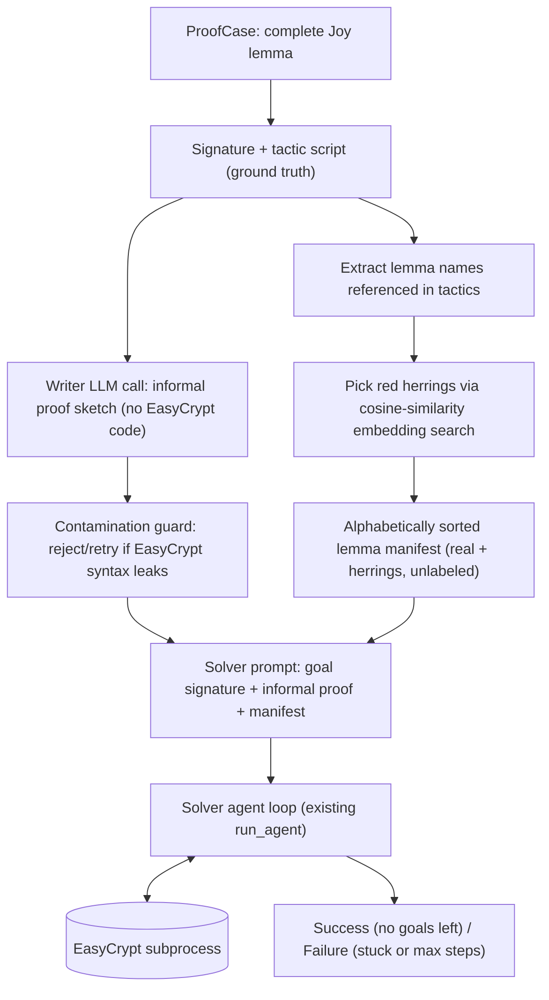

# Running `joy-informal-repair`

This experiment measures an LLM agent's ability to reprove an EasyCrypt
lemma from scratch, given only a natural-language proof sketch and a curated
(partly decoy) list of candidate lemmas — never the real tactic script.

## Why this exists

Earlier experiments considered starting from proofs that are broken for
unknown reasons (e.g. because they target an old EasyCrypt release) and
asking an agent to make the proof obligations go away. That approach has a
fundamental problem: without a cryptography expert reviewing every result,
nobody can trust that an LLM-discovered "fix" for an unfamiliar broken proof
is actually a valid proof of the *intended* statement, rather than the LLM
quietly moving the goalposts (weakening the goal, exploiting a loophole,
etc.).

`joy-informal-repair` sidesteps this entirely: the proof goal always comes
from an **existing, complete proof** in the Joy corpus (verified with
`is_proof_complete()` before use), so it is never at risk of being
LLM-manufactured or LLM-altered. The only thing an LLM is asked to do is
*redescribe* — never modify — the reasoning behind that proof in plain
English, and even that step is guarded against leaking the real proof.

## Architecture



The writer call and the solver loop are two separate, independent LLM calls
(the same underlying model can be used for both, but in distinct,
non-conversational contexts): the writer runs once, upfront, before the
solver ever starts. Only the writer's filtered text output ever reaches the
solver's prompt — the real tactic script is never included in `repair_hint`
or anywhere else the solver can see (`repair_hint` is always `None` for this
spec; see [`integration/experiment/runner.py`](runner.py)'s
`run_informal_trial`).

## Pipeline, step by step

1. **Verify the source proof is genuinely complete** — `is_proof_complete()`
   on the original sandboxed lemma; skip (`not_complete`) if not.
2. **Fetch the premises catalog** visible right before `proof.` (everything
   referenced inside the proof must already be globally accessible at that
   point) via `fetch_premises_at_cursor()`.
3. **Extract which lemmas the real proof actually used** —
   `extract_used_lemma_names()` does a word-boundary text search of the
   hidden tactic script against the catalog's names. This is a simple
   heuristic; a lemma name has to appear literally in the tactic text to
   count as "used".
4. **Write the informal proof** — `write_informal_proof()` makes a single
   chat completion call with a system prompt that explicitly forbids
   EasyCrypt syntax, tactic names, and code blocks, and gives the model the
   lemma signature plus the tactic script only as hidden background context
   for grounding its reasoning (not to be repeated or paraphrased literally).
5. **Contamination guard** — `looks_contaminated()` regex-scans the writer's
   output for likely EasyCrypt leakage (code fences, `qed.`, `smt(`,
   `rewrite /`, `by <tactic-keyword>`). If triggered, the writer is asked
   once more, with a stricter reminder. If still contaminated after the
   retry, the whole trial is skipped (`skip_reason="writer_leaked_code"`)
   rather than silently used — better to lose a trial than to leak the
   answer.
6. **Select red herrings** — `select_red_herrings()` embeds each used
   lemma's signature and the rest of the catalog (via the same
   `EmbeddingClient` used for premise ranking elsewhere in the agent),
   then picks the most cosine-similar non-used lemmas as decoys, up to
   `max(1, round(red_herring_ratio * len(used)))` (default ratio: 0.3, i.e.
   roughly 30% of the real lemma count). Choosing lemmas that are
   *semantically close* to the real ones (rather than random) makes them
   plausible distractors instead of trivially-obvious noise.
7. **Build the manifest** — `build_lemma_manifest()` merges real + decoy
   lemmas and sorts them alphabetically by name, so their order carries no
   signal about which are real.
8. **Empty-slate start file** — same mechanism as the mutation-repair
   experiment: `strip_tactics()` removes all tactic lines and the trailing
   `qed.`, leaving just the signature and a bare `proof.`.
9. **Run the solver** — `run_agent()` exactly as in every other experiment,
   with `AgentConfig.informal_proof` set to the sketch and
   `AgentConfig.premises_override` set to the manifest (so the "Top relevant
   premises" section of the prompt is drawn only from this curated pool,
   still ranked per-iteration by cosine similarity to the current goal, the
   same way premises are ranked everywhere else). The `lookup_lemma` tool
   still uses the full corpus-wide `lemma_lookup_index()`, unrestricted,
   same as the other experiments.
10. **Post-hoc scoring** — after the run, the final working copy is scanned
    for references to manifest names, recording how many real lemmas vs. red
    herrings the agent actually incorporated into its final tactics.

## Prerequisites

Same as `joy-tactic-repair`: the Joy corpus must be cloned/extracted/indexed,
and an LM Studio-compatible server must be running with a chat model and an
embedding model:

```bash
python3 -m benchmark clone --only tejasanilshah-the-joy-of-easycrypt
python3 -m benchmark extract
python3 -m benchmark index
```

No additional setup is needed beyond what `joy-tactic-repair` already
requires (patched EasyCrypt binary, why3 prover — see the general
[README.md](README.md) and, if coming from the yao investigation,
[YAO_BROKEN_REPAIR.md](YAO_BROKEN_REPAIR.md) for those steps).

## Running

```bash
python3 -m integration.experiment run \
  --spec joy-informal-repair \
  --trials 10 \
  --stuck-limit 20 \
  --max-steps 200 \
  --llm-model <model> \
  --embed-model <embed-model> \
  --red-herring-ratio 0.3 \
  --writer-temperature 0.7
```

`--red-herring-ratio` and `--writer-temperature` are optional and only apply
to this spec; they default to `InformalConfig`'s values (0.3 and 0.7).

## Success, failure, and timeouts

Identical semantics and mechanisms to every other experiment — nothing new
was introduced:

- `ExitReason.COMPLETE` (no goals left) → **success**
- `ExitReason.MAX_STEPS` or `ExitReason.STUCK` → **failure**
- `EASYCRYPT_TIMEOUT` / `LM_STUDIO_TIMEOUT` subprocess timeouts
  (`AgentConfig`) bound every EasyCrypt/LLM call, same as elsewhere

## Where results land

```
integration/output/experiments/<timestamp>/
├── summary.json          # aggregate metrics; "mode": "informal"
├── events.jsonl          # per-trial event log
└── trials/trial_NNN/
    ├── original.ec               # the verified-complete sandboxed lemma
    ├── informal_proof.md         # the writer LLM's code-free proof sketch
    ├── lemma_manifest.json       # name -> signature, sorted, unlabeled —
    │                              # exactly what the solver is given
    ├── lemma_manifest_labeled.json  # name -> {signature, is_real} — ground
    │                                 # truth for analysis; NEVER shown to
    │                                 # the solver
    ├── agent_start.ec            # signature + `proof.` only — empty slate
    ├── agent_work.agent.ec       # solver's working copy as it appends tactics
    └── agent_log.json            # full step-by-step activity log (goals,
                                   # ranked premises, every tactic/undo/lookup
                                   # tried, and its outcome)
```

`summary.json` and each trial's entry also carry:

- `used_lemma_count` — how many real lemmas were found in the original proof
- `red_herring_count` — how many decoys were added
- `real_lemmas_referenced` / `red_herrings_referenced` — how many of each the
  solver actually used in its final proof (a proxy for whether it was
  grounding its tactics correctly vs. leaning on noise)

`agent_log.json` is the full activity log; `summary.json` + `events.jsonl`
are the aggregate/per-trial performance summary, same as
`joy-tactic-repair`.

## Known limitations

- **Name-matching is textual, not semantic.** `extract_used_lemma_names()`
  only catches a lemma as "used" if its exact name literally appears in the
  tactic script. Lemmas invoked implicitly (e.g. via `smt()` calling
  external solvers without naming a lemma) will not be counted as used, and
  won't appear in the manifest at all unless coincidentally picked as a red
  herring.
- **No red herrings when nothing was matched as used.** If
  `extract_used_lemma_names()` finds zero used lemmas (e.g. a proof that is
  just `trivial.`), `used_lemma_count` and `red_herring_count` are both 0
  and the manifest is empty — the solver gets the informal proof only, no
  candidate lemma list.
- **The contamination guard is a heuristic**, not a proof. It is
  deliberately narrow (keyed to distinctive EasyCrypt syntax like `qed.`,
  `smt(`, `rewrite /`, `by <tactic-keyword>`) to avoid false-positiving on
  ordinary mathematical prose, but it cannot catch every possible leak.
